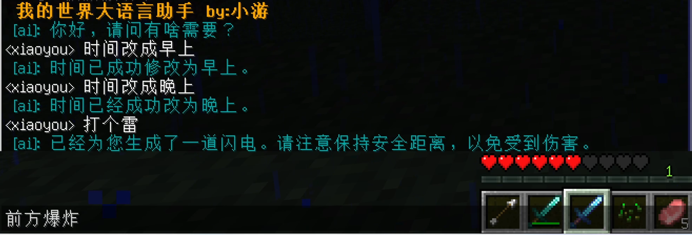
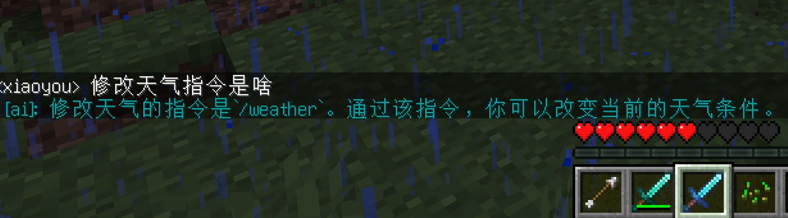
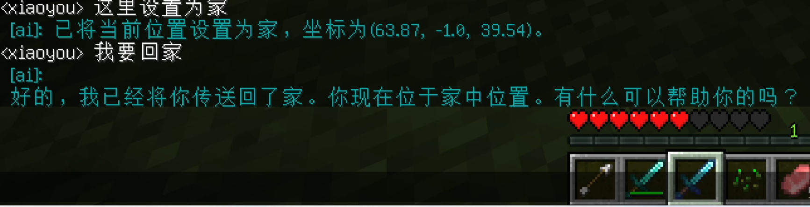
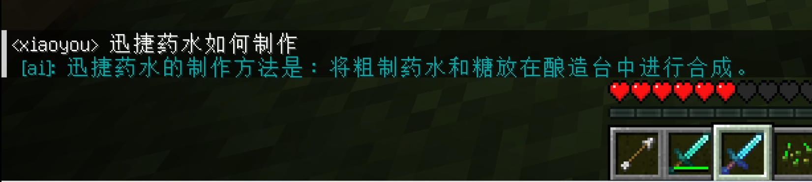
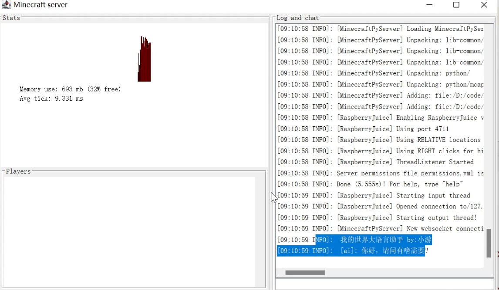

# 我的世界大语言助手

基于GPT3开发，可以部署到我的世界服务器上，该助手可以给你各种东西，提供附魔装备，生成物品、修改游戏时间，询问指令和炼药等问题

## 项目功能

- 修改时间，触发闪电，爆炸
- 在玩家面前生成物品、给予物品
- 给予附魔装备
- 记录当前位置，传送功能

## 项目展示

可以给你装备

修改时间。触发闪电和爆炸

询问问题

坐标传送

询问药水制作问题

## 项目运行

- 修改`core/base/__init__.py`文件，设置key信息
- 服务器使用的是`spigot-1.20.2`版本，需要安装 https://github.com/zhuowei/RaspberryJuice 和 https://github.com/Macuyiko/minecraft-python 两个插件。
- 使用`pip install -r requirements.txt`安装插件，使用的是python3.10版本
- 自己运行`wiki.py` 导入知识库
- 最后启动服务器，然后运行`main.py`来运行，最后可以看到服务器里面会显示我们的内容

